# SAOIF傷害計算公式以及推導過程

# 前言
    
    對於本游戲傷害的計算公式早在2021年已經非常完善
    現為幫助更多想深入理解游戲的人創作本文

適合人群

    本文不適合新手閲讀，新手請退出
    本文旨在幫助已經有一定游戲理解的人去深入理解游戲的傷害計算方式

注意事項

    本文只對傷害的計算公式進行解析和驗證
    本文出現的配卡只為測試使用，不考慮任何實戰合理性
    本文展示的截圖，只為測試過程中的一小部分
    圖片用於展示實際測試值幫助理解
    實際測試過程中，有經過大量的測試和驗證過程，在此不作列出
    使用本文公式計算傷害過程中可能會存在一定微小誤差為正常現象

問題解答

    若有疑問，請認真閲讀本文所有内容后再提出

    若要反駁本文觀點，請指出錯誤
    反駁時附上所有存疑的測試過程和結果作爲證據
    反駁時給出你的修正方案並驗證方案的合理性
    
    
    

# 目錄

* [基礎知識](#一基礎知識)
* [使用追加傷害推導部分傷害公式](#二使用追加傷害推導部分傷害公式)
* [控制攻擊力和倍率推導boss防禦影響](#三控制攻擊力和倍率推導boss防禦影響)
* [覺醒率影響](#四覺醒率影響)
* [混沌追憶作用](#五混沌追憶作用)
* [最終公式和結論](#六最終公式和結論)

## 一、基礎知識

基礎知識作爲游戲常識，在本文中不加以驗證

以下是部分基礎知識：

    追加傷害無視防禦，能夠受一系列傷害加成影響
    基礎爆擊傷害50%
    一般情況下基礎弱點傷害50%，除非有特殊説明（discord可查）
    面板顯示攻擊的為最大值
    武器攻擊力在某個區間内有一定浮動（具體看武器强化界面）

## 二、使用追加傷害推導部分傷害公式

### 數據展示

面板

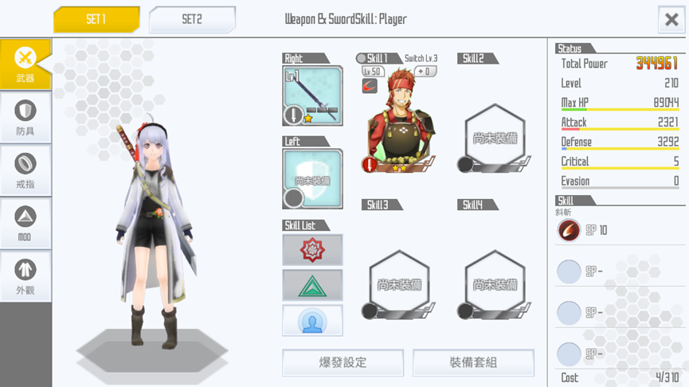

測試卡

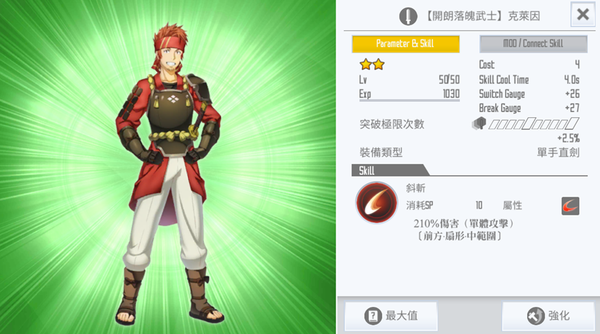

### 關掉以下熟練度技能去除影響

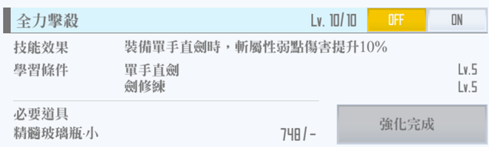

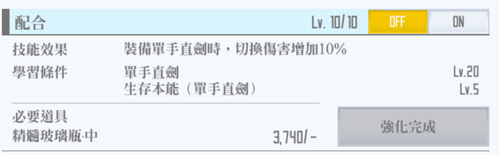

### 測試boss

冥黑155灼射

    99%武器抗性
    50%斬弱
    50%暗弱

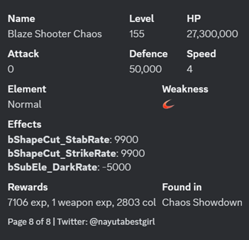

冥黑195牢城主

    50%傷害抗性
    40%爆擊抗性
    300%武器抗性
    50%刺弱
    50%暗弱
    150%其他屬性抗性

### 測試數據

以下為基礎數據，後續測試在此基礎上增加其他傷害加成

普通攻擊

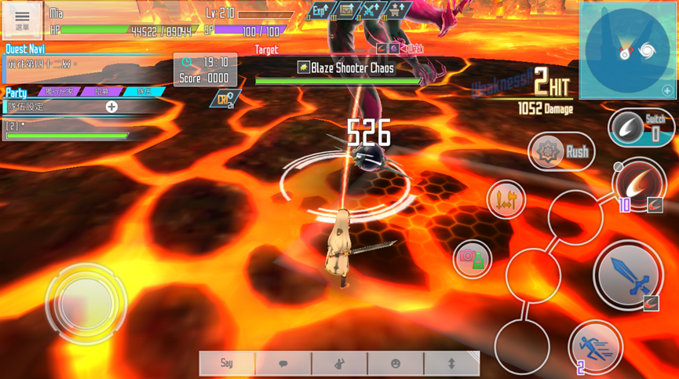

技能

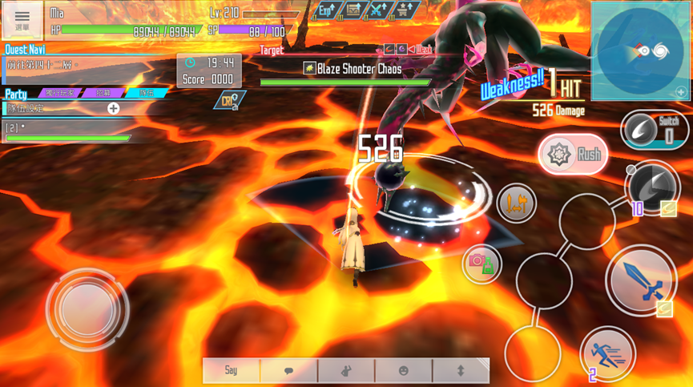

由於boss過高防禦影響，由攻擊和倍率產生的傷害被抵消，只剩下追加傷害生效。

傷害組成：

    追加傷害350
    强制扣血1
    斬弱50%

得出如下：

    (350+1)*(1+50%)=526.5
    526.5向下取整=>526

使用賦予

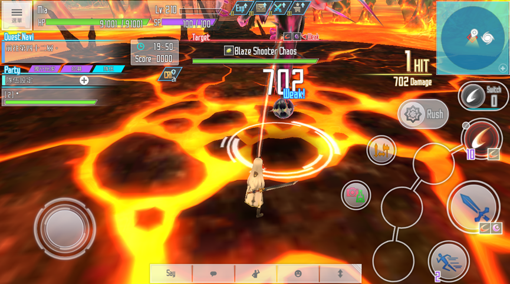

傷害組成：

    追加傷害350
    强制扣血1
    斬弱50%
    暗弱50%

得出如下：

    (350+1)*(1+50%+50%)=702

説明自然屬性弱點和武器屬性弱點在同一區間

使用爆擊

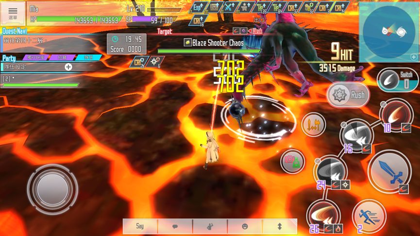

傷害組成：
    
    追加傷害350
    强制扣血1
    斬弱50%
    爆擊50%

得出如下：

    (350+1)*(1+50%+50%)=702

説明爆擊傷害和武器屬性弱點在同一區間

使用細劍+賦予

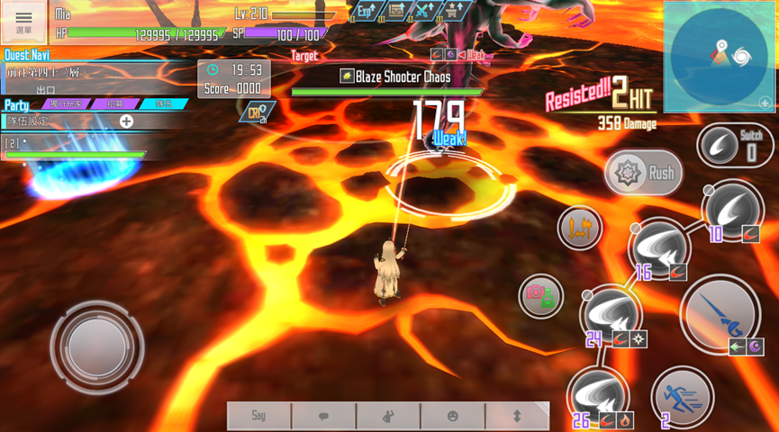

傷害組成：

    追加傷害350
    强制扣血1
    武器抗性99%
    暗弱50%

得出如下：

    (350+1)*(1+50%-99%)=179.01向下取整=>179

説明抗性和弱點爆傷等在同一區間且為綫性叠加關係(簡單相加減)

使用2倍刻印

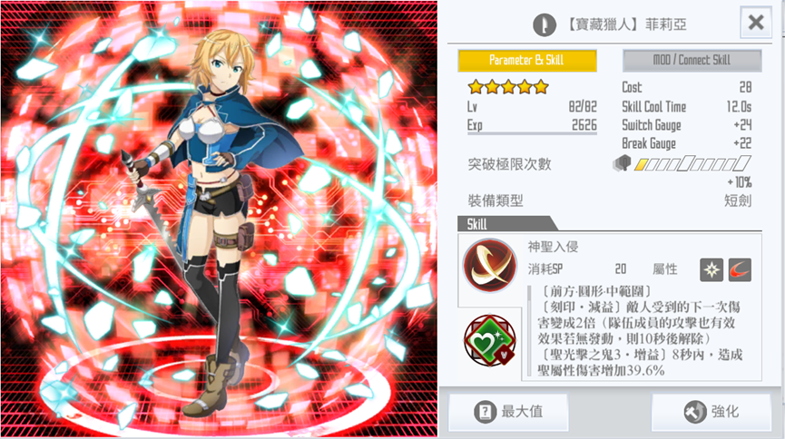

這裏雖然顯示boss有一個盾的buff，其實傷害是在此buff出現前打出的所以不影響

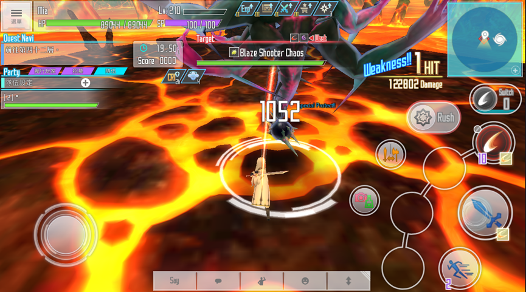

傷害組成：

    追加傷害350
    强制扣血1
    斬弱50%
    刻印2倍

得出如下：

    (350+1)*(1+50%)*2=1053

推斷：

    在(350+1)*1.5=526.5后可能對傷害進行了向下取整操作
    (350+1)*1.5=526.5向下取整=>526
    562*2=1052

使用死兆印+刻印

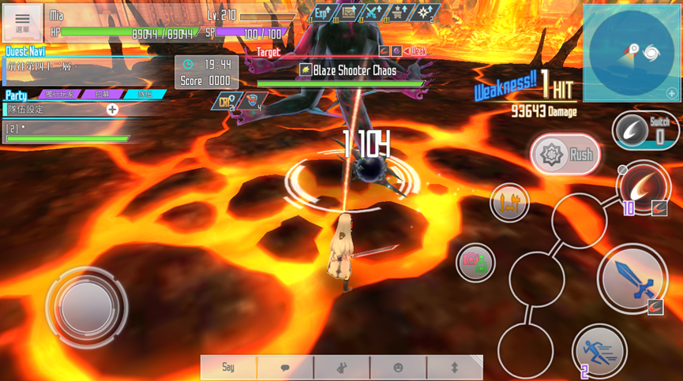

傷害組成：

    追加傷害350
    强制扣血1
    斬弱50%
    死兆印1.1倍
    刻印2倍

得出如下：

    (350+1)*(1+50%)*(1+0.1+1)= 1105.65
    (350+1)*1.5=526.5向下取整=>526
    562*2.1=1104.6向下取整=>1104

得出死兆印刻印在同一區間且為綫性叠加關係

其他如小刻印，2.5倍刻印同樣在此區間就不一一測試了

攻擊90級混沌人馬50層免傷(傷害抗性)

雙克爆擊情況傷害為1

説明免傷為100%，因爲有一個乘區為0，所以其他乘區增傷再高也無效

使用刻印傷害正常，説明免傷在刻印區間且為綫性叠加關係

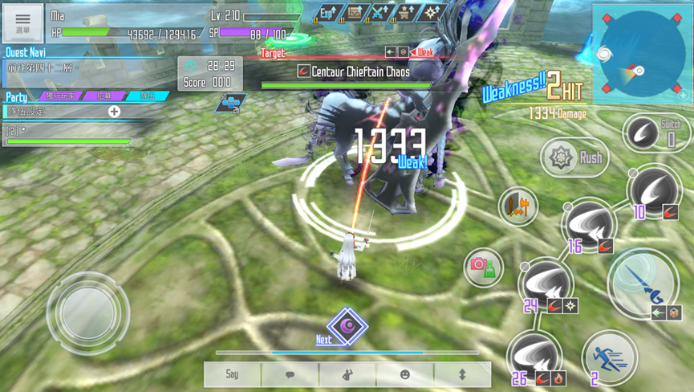

雙克攻擊牢城主

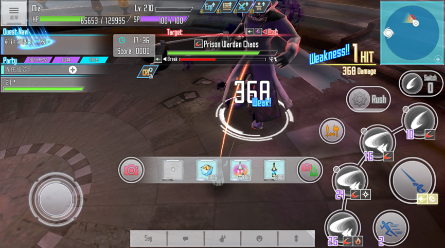

傷害組成：

    追加傷害350
    强制扣血1
    刺弱50%+10%
    暗弱50%
    傷害抗性50%

得出如下：
    
    (350+1)*(1+50%+10%+50%)*(1-50%)= 1,105.65
    (350+1)*2.1= 737.1向下取整=>737
    737*0.5=368.5向下取整=>368

雙克攻擊具有混沌追憶的牢城主

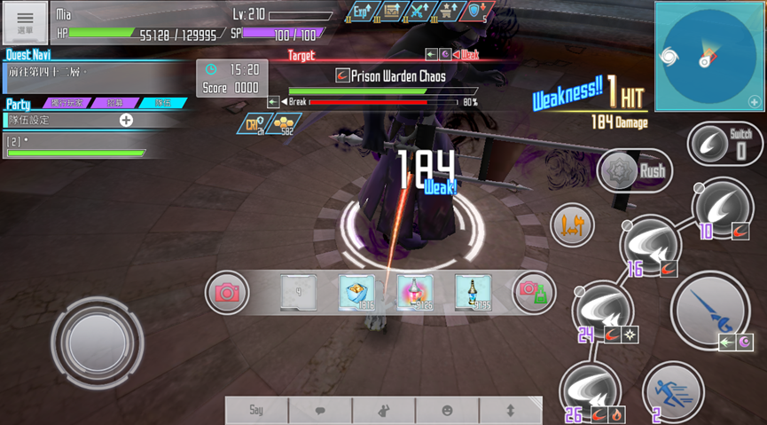

傷害組成：

    追加傷害350
    强制扣血1
    刺弱50%+10%
    暗弱50%
    傷害抗性50%
    混沌追憶免傷50%

得出如下：

    (350+1)*(1+50%+10%+50%)*(1-50%)= 1,105.65
    (350+1)*2.1= 737.1向下取整=>737
    737*0.5=368.5向下取整=>368
    368*0.5=184
    説明混沌追憶為另一個獨立區間

### 結論一

    由追加傷害得出的初步公式：
    縂傷害=追加傷害 * 增傷區間 * 刻印區間 * 混沌追憶區間
    增傷區間：爆傷，弱點，抗性
    刻印區間：刻印，免傷
    傷害區間相乘時先對當前傷害進行向下取整操作
    如果某個乘區為0或小於0時，則只能造成1的强制扣血

## 三、控制攻擊力和倍率推導boss防禦影響

### 數據展示

測試技能卡

關閉部分倍率相關熟練度方便計算

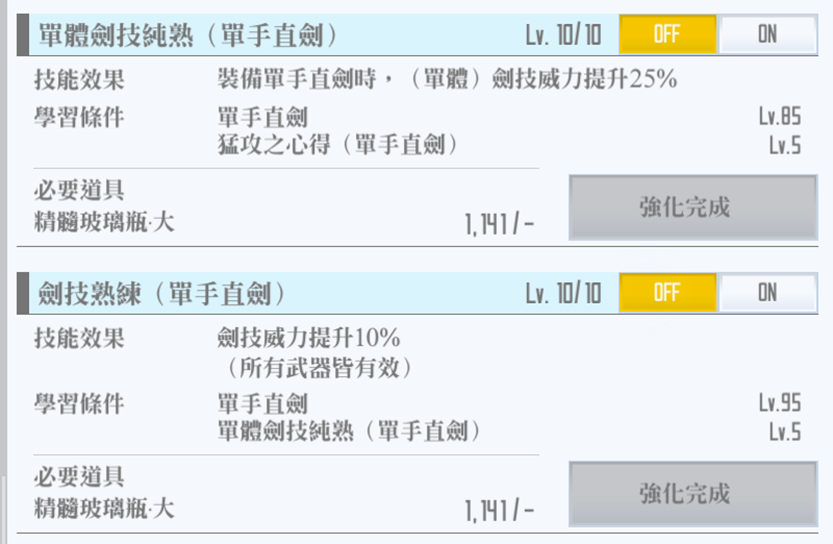

面板數據

### 測試結果

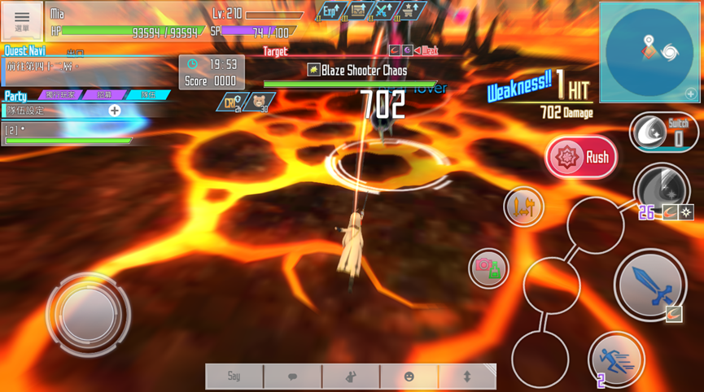

未突破防禦傷害組成：

    攻擊力3116
    倍率1120%+100%(來自熟練度)=1220%
    boss防禦50000
    追加傷害350
    强制扣血1
    斬弱50%
    MOD自帶增傷50%

得出如下：

    攻擊*倍率=3116*1220%=38015.2向下取整=>38015
    38015*(1+50%+50%)=76030
    (350+1)*(1+50%+50%)=702

可猜測防禦作用範圍：

猜想1：

    攻擊*倍率*增傷-防禦=76030-50000=26030
    如果是最終傷害減去防禦計算則會有26030左右傷害和追加傷害
    實際上只造成了追加傷害顯然不成立

猜想2：

    (攻擊*倍率-防禦)*增傷=38015-50000<0  =>造成强制扣血1
    縂傷害再加上追加傷害部分

### 對猜想2進行驗證

調整面板

武器攻擊力區間

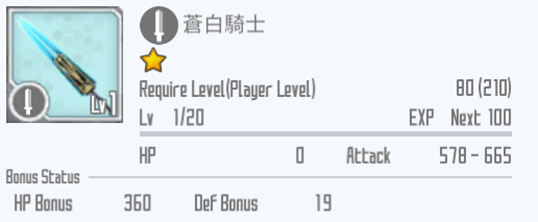

    攻擊加成：
    7*5%+10%+15%=60%
    攻擊浮動值(665-578)*(1+60%)=139.2向下取整=>139
    攻擊浮動範圍5181~5320

多次測試

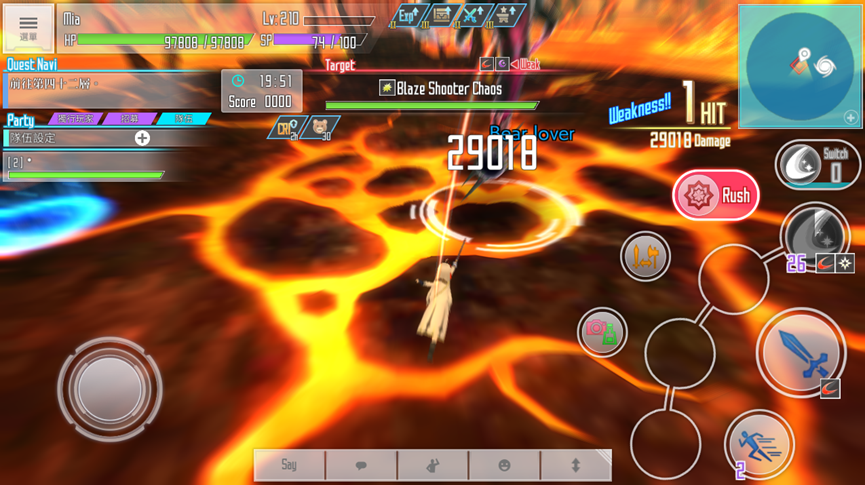

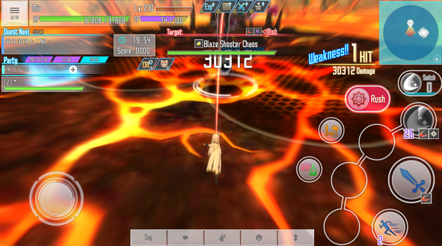

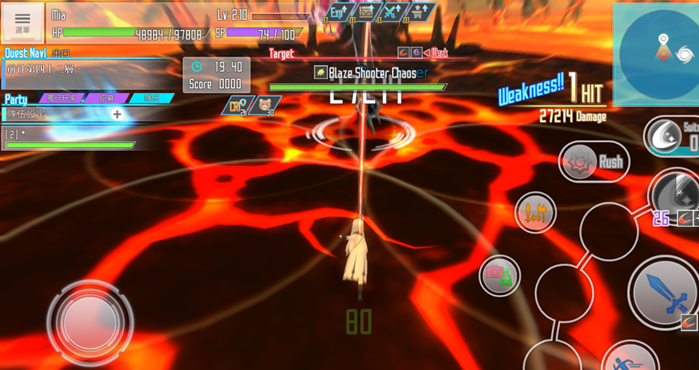

    突破防禦傷害組成：
    攻擊力5181~5320
    倍率1120%+100%=1220%
    boss防禦50000
    追加傷害350
    斬弱50%
    MOD自帶增傷50%
    得出如下：
    攻擊*倍率=63208~64904
    減去防禦得傷害13208~14904

    傷害範圍：
    [(13208+350)~(14904+350)]*(1+50%+50%)=27116~30508
    顯然三次測試傷害都落在該區間内

### 結論二
    加入防禦計算的傷害公式：

    基礎傷害=[(攻擊*倍率-防禦)+追加傷害]
    如果(攻擊*倍率-防禦)<0則置爲强制扣血1
    傷害加成=增傷區間*刻印區間*(1-混沌追憶)

    縂傷害=基礎傷害*傷害加成
    =[(攻擊*倍率-防禦)+追加傷害]*增傷區間*刻印區間*(1-混沌追憶)

## 四、覺醒率影響

### 數據展示

面板

覺醒卡均選用生命回復消除多餘影響

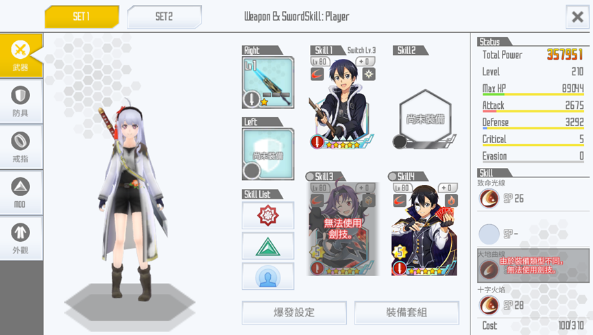

### 初步測試

直接攻擊未破防禦

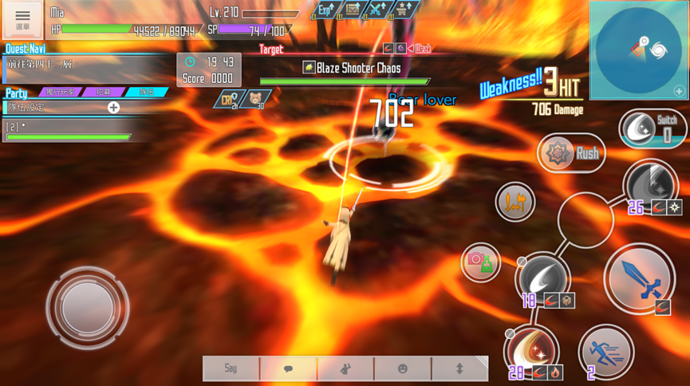

覺醒率40%，覺醒后攻擊

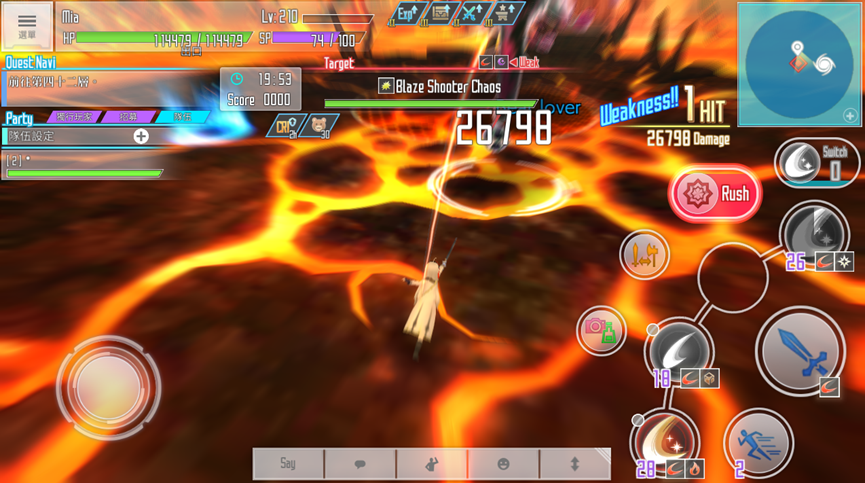

傷害組成：

    攻擊力2675
    倍率1120%+100%=1220%
    boss防禦50000
    追加傷害350
    斬弱50%
    MOD自帶增傷50%
    覺醒率40%
得出如下：

    攻擊*倍率=32635<50000

但是實際上造成傷害説明覺醒時無視防禦

若覺醒時完全無視防禦則

    造成(32635+350)*(1+50%+50%)*(1+40%)遠遠大於實際的26789

顯然不成立，説明覺醒只部分無視防禦。

猜測由於覺醒提升的部分傷害無視防禦，剩餘傷害會被怪物防禦影響。

則:

    總傷害=(1+350)*(1+50%+50%)+
    (32635+350)*(1+50%+50%)*40%=702+26388=27090

符合實際情況

覺醒時使用1.5倍刻印

發現并未對傷害進行提升

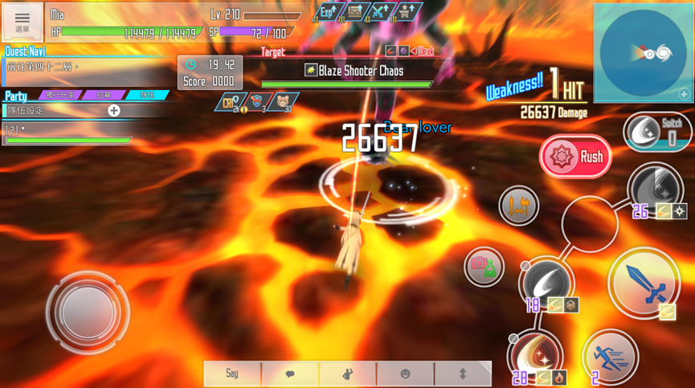

傷害組成：

    攻擊力2675
    倍率1120%+100%=1220%
    boss防禦50000
    追加傷害350
    斬弱50%
    MOD自帶增傷50%
    攻擊*倍率=32635<50000

初步猜測：

    縂傷害=[(攻擊*倍率-防禦)+追加傷害]*增傷區間*刻印區間+
    [攻擊*倍率+追加傷害]*增傷區間*覺醒率=
    (1+350)*(1+50%+50%)*(1+50%)+
    (32635+350)*(1+50%+50%)*40%=1053+26388=27441

根據以上結果把傷害組成分爲兩部分：

    普通傷害=[(攻擊*倍率-防禦)+追加傷害]*增傷區間*刻印區間
    覺醒傷害=[攻擊*倍率+追加傷害]*增傷區間*覺醒率

怪物防禦，刻印，免傷等僅對普通傷害進行作用，即覺醒部分傷害無視防禦，無視免傷

### 改變覺醒率多次驗證
30%覺醒率

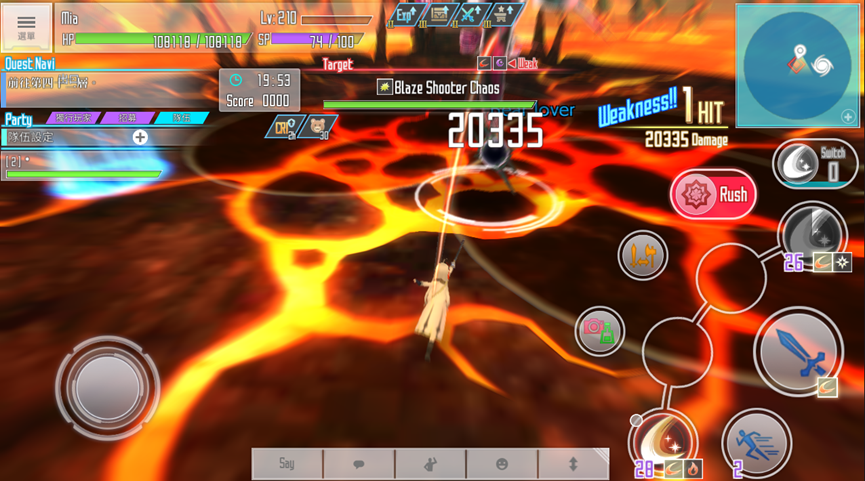

傷害組成：

    攻擊力2675
    倍率1120%+100%=1220%
    boss防禦50000
    追加傷害350
    斬弱50%
    MOD自帶增傷50%
得出如下：

    總傷害=(1+350)*(1+50%+50%)+
    (32635+350)*(1+50%+50%)*30%=702+19791=20493

50%覺醒率

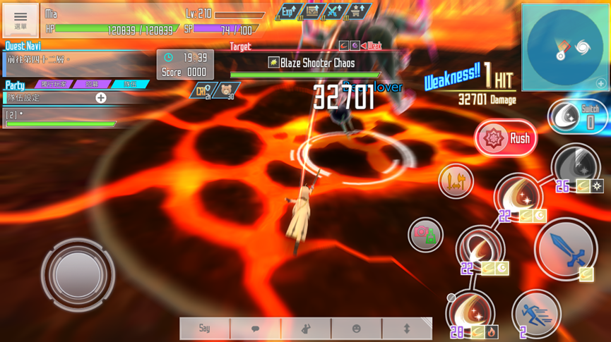

傷害組成：

    攻擊力2675
    倍率1120%+100%=1220%
    boss防禦50000
    追加傷害350
    斬弱50%
    MOD自帶增傷50%

得出如下：

    總傷害=(1+350)*(1+50%+50%)+
    (32635+350)*(1+50%+50%)*50%=702+32985=33687

### 結論三

    加入覺醒率計算的初步公式（覺醒情況下對無混沌追憶boss傷害）：
    普通傷害基礎傷害=[(攻擊*倍率-防禦)+追加傷害]
    普通傷害的傷害加成=增傷區間*刻印區間
    普通傷害=[(攻擊*倍率-防禦)+追加傷害]*增傷區間*刻印區間
    覺醒傷害基礎傷害=[攻擊*倍率+追加傷害]
    覺醒傷害的傷害加成=增傷區間*覺醒率
    覺醒傷害=[攻擊*倍率+追加傷害]*增傷區間*覺醒率
    縂傷害=普通傷害+覺醒傷害=
    [(攻擊*倍率-防禦)+追加傷害]*增傷區間*刻印區間+
    [攻擊*倍率+追加傷害]*增傷區間*覺醒率

## 五、混沌追憶作用

### 數據展示

測試面板

### 詳細測試

無覺醒

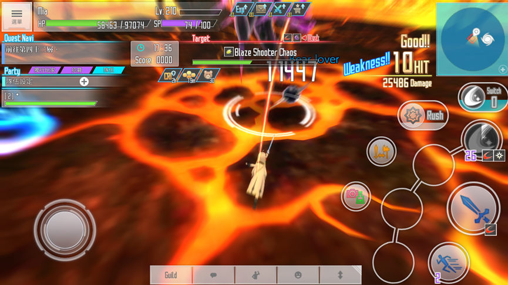

屬性值：

    攻擊力5066
    倍率1220%
    boss防禦50000
    增傷100%
    混沌追憶免傷50%
    普通傷害基礎傷害=(5066*1220%-50000+350)=12155
    覺醒基礎傷害=(5066*1220%+350)= 62155
    無覺醒實際傷害11447
    理論縂傷害值=(5066*1220%-50000+350)*(1+100%)*(1-50%)=12155

根據官方覺醒機制描述為無視混沌追憶

所以覺醒部分傷害不會受混沌追憶影響

    根據之前結論：覺醒傷害=[攻擊*倍率+追加傷害]*增傷區間*覺醒率

30%覺醒率

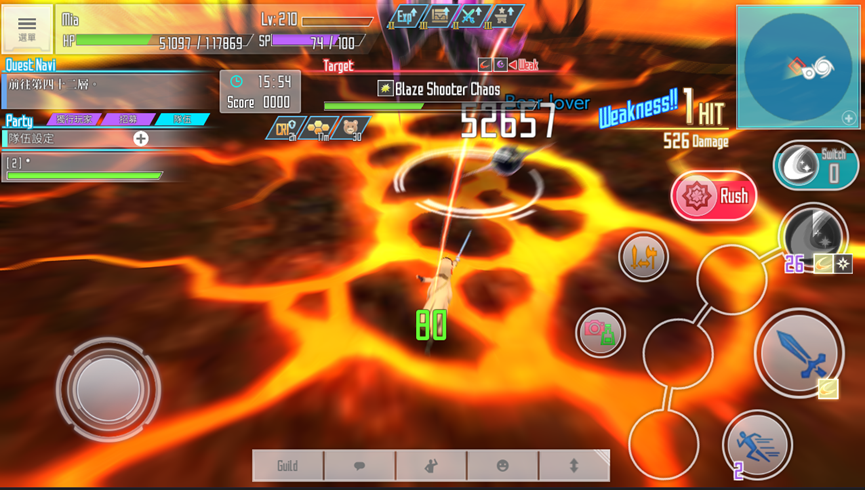

    30%覺醒率實際傷害52657
    覺醒傷害值=62115*(1+100%)*30%=37269
    普通傷害值=15338
    相對於無覺醒普通傷害變化=(15338-12155)/12155=26%

40%覺醒率

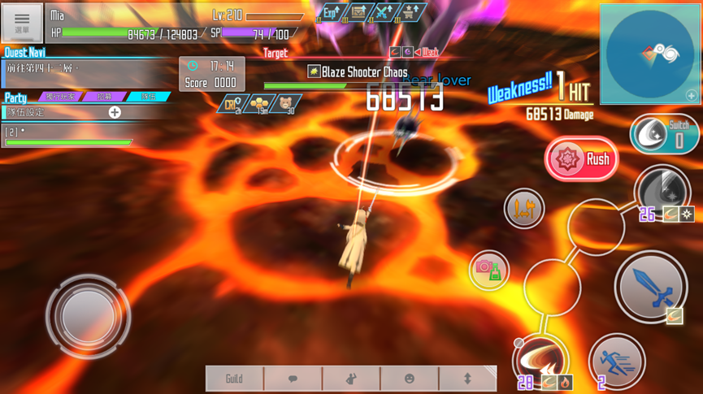

    40%覺醒率實際傷害68513
    覺醒傷害值=62115*(1+100%)*40%=49692
    普通傷害值=18821
    相對於無覺醒普通傷害變化=(18821-12155)/12155=55%
    相對於30%覺醒率普通傷害變化(18821-15338)/ 15338=22%

50%覺醒率

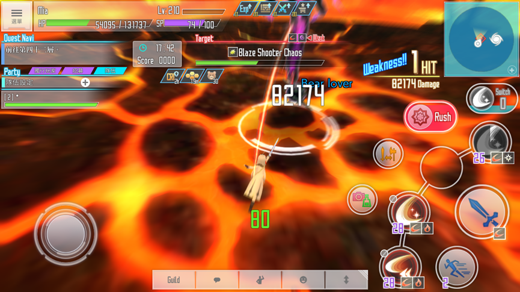

    50%覺醒率實際傷害82714
    覺醒傷害值=62115*(1+100%)*50%=62115
    普通傷害值=20559
    相對於無覺醒普通傷害變化=(20559-12155)/12155=69%
    相對於40%覺醒率普通傷害變化=(20559-18821)/ 18821=9%

60%覺醒率

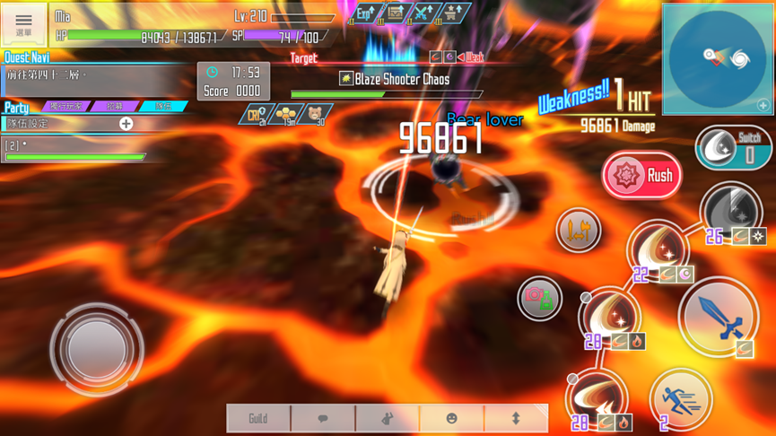

    60%覺醒率實際傷害96861
    覺醒傷害值=62115*(1+100%)*60%=74538
    普通傷害值=22323
    相對於無覺醒普通傷害變化=(22323-12155)/12155=84%
    相對於50%覺醒率普通傷害變化=(22323-20559)/ 20559=8%

70%覺醒率

70%覺醒率以上時，攻擊力稍微高了幾點這裏就忽略不計了

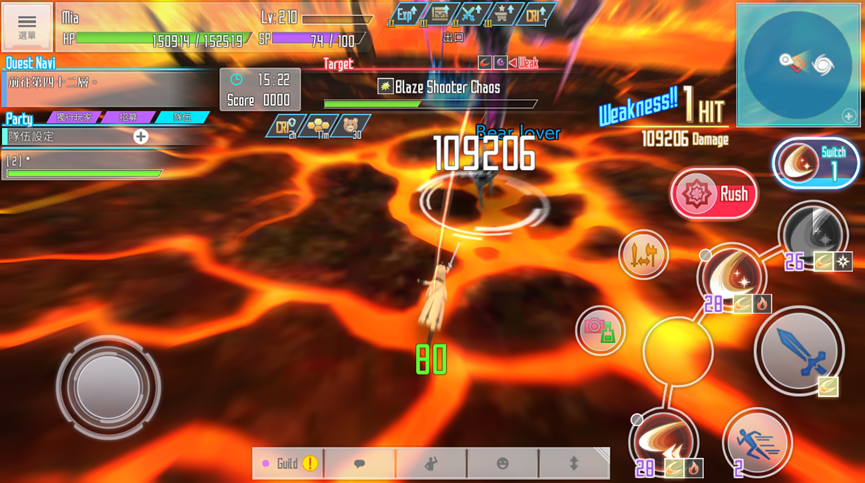

    70%覺醒率實際傷害109206
    覺醒傷害值=62115*(1+100%)*70%=86961
    普通傷害值=22245
    相對於無覺醒普通傷害變化=(22245-12155)/12155=83%
    相對於60%覺醒率普通傷害變化=(22245-22323)/ 22323=-0.3%

80%覺醒率

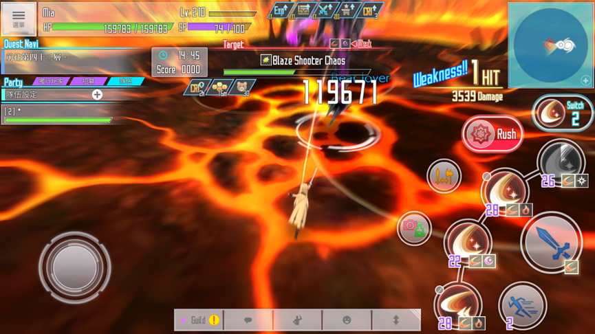

    80%覺醒率實際傷害119671
    覺醒傷害值=62115*(1+100%)*80%=99384
    普通傷害值=20287
    相對於無覺醒普通傷害變化=(20287-12155)/12155=67%
    相對於70%覺醒率普通傷害變化=(20287-22245)/ 22245=-8%

### 結論四

    可以看出覺醒時，普通傷害由於混沌追憶作用被抵消一部分
    隨覺醒率提高，混沌追憶效果減弱
    但是覺醒率50以上時并沒有增長
    可以猜測
    普通傷害=[(攻擊*倍率-防禦)+追加傷害]*
    增傷區間*刻印區間*(1-混沌追憶+覺醒率)
    
    則重新計算各個理論值:
    30%覺醒率52657
    覺醒傷害值=62115*(1+100%)*30%=37269
    普通傷害值=12155*(1+100%)*(1+30%-50%)=19448
    縂傷害值=56717

    40%覺醒率68513
    覺醒傷害值=62115*(1+100%)*40%=49692
    普通傷害值=12155*(1+100%)*(1+40%-50%)=21879
    縂傷害值=71571

    50%覺醒率以上：

    50%覺醒率82714
    覺醒傷害值=62115*(1+100%)*50%=62115
    普通傷害值=12155*(1+100%)*(1+50%-50%)=24310
    縂傷害值=86425

    60%覺醒率96861
    覺醒傷害值=62115*(1+100%)*60%=74538
    普通傷害值=12155*(1+100%)*(1+60%-50%)=26741
    縂傷害值=101279

    70%覺醒率109206
    覺醒傷害值=62115*(1+100%)*70%=86961
    普通傷害值=12155*(1+100%)*(1+70%-50%)=29172
    縂傷害值=116113
    80%覺醒率119671

    覺醒傷害值=62115*(1+100%)*80%=99384
    普通傷害值=12155*(1+100%)*(1+80%-50%)=31603
    縂傷害值=130987

    在50%覺醒率以上時出現較大誤差
    則猜測覺醒率抵消混沌追憶后不對普通傷害產生增傷效果
    則普通傷害值=24310

    50%覺醒率82714
    縂傷害值=86425

    60%覺醒率96861
    縂傷害值=74538+24310=98848

    70%覺醒率109206
    縂傷害值=86961+24310=111271

    80%覺醒率119671
    縂傷害值=99384+24310=123694

    誤差明顯減小説明猜想正確
    得出混沌追憶影響下普通傷害計算公式：

    普通傷害=[(攻擊*倍率-防禦)+追加傷害]*
    增傷區間*刻印區間*(1-混沌追憶+覺醒率)

    (1-混沌追憶+覺醒率)該部分最大為1

## 六、最終公式和結論

### 傷害計算公式

    基礎攻擊浮動范围*攻擊加成=攻擊浮動範圍

    普通傷害基礎傷害=[(攻擊浮動範圍*倍率-目標防禦)+追加傷害]
    
    基礎傷害中(攻擊浮動範圍*倍率-目標防禦)最小為1

    混沌追憶區間=(1-混沌追憶免傷率+覺醒率)
    混沌追憶區間只能為1或小於1

    普通傷害縂傷害=[(攻擊浮動範圍*倍率-目標防禦)+追加傷害]
    *增傷區間*刻印區間*(1-混沌追憶免傷率+覺醒率)

    覺醒傷害基礎傷害=(攻擊浮動範圍*倍率+追加傷害)
    覺醒傷害縂傷害=(攻擊浮動範圍*倍率+追加傷害)*增傷區間*覺醒率

    縂公式文字描述：
    理论傷害=[(基礎攻擊浮動范围*攻擊加成*倍率-目標防禦)+追加傷害]
    *增傷區間*刻印區間*(1-混沌追憶免傷率+覺醒率)+
    (攻擊浮動範圍*倍率+追加傷害)*增傷區間*覺醒率
    且：
    普通傷害部分倍率和目標防禦影響的傷害不爲負數，最小為1
    目標防禦最小為1
    增傷（抗性）區間小於等於0時，受到該區間影響的最終傷害為1
    刻印區間小於等於0時，普通傷害為1
    在非覺醒情況下覺醒率以0代入
    每次相乘操作后對數值進行向下取整

    由於各種追加詞條的影響會出現某些變式（防禦轉攻擊，生命轉追加傷害等）
    只需要加入到對應區間即可，這裏就不一一展開

### 傷害加成和區間歸類

    基礎攻擊力

    增傷（抗性）區：爆擊傷害，弱點傷害，對應屬性增傷
    以及除背刺外的各種描述的增傷等
    boss弱點抗性

    刻印區：烙印，死兆印，刻印，衰印
    背刺詞條（弓箭，短劍常見，以及部分被動）
    鐵塊副作用減傷
    boss傷害抗性

    覺醒率：基礎20%，覺醒卡等級，部分被動詞條（精神統一）

