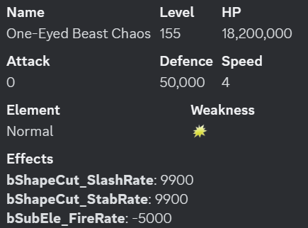
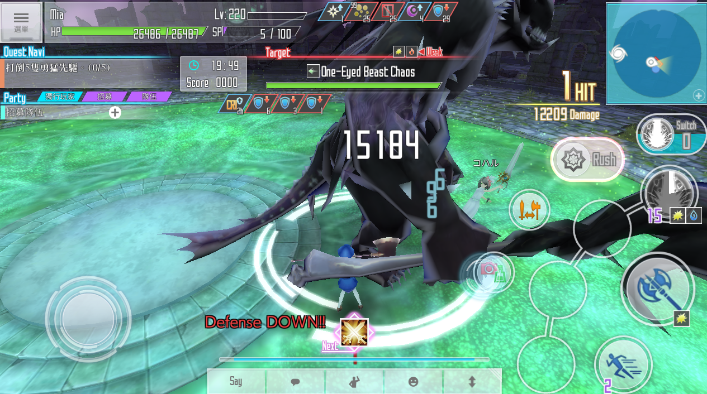
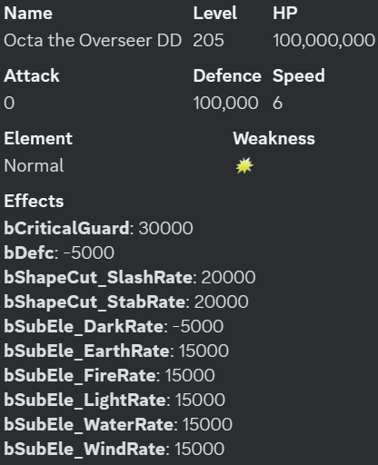

# SAOIF目標防禦具體分析

# 前言
    
    前面已經描述了加入防禦的具體公式
    這裏給出對目標防禦更具體的分析

    以及推導特殊怪物詞條
    bDefc詞條對與防禦的影響關係

# 目錄

* [驗證防禦不能為負值](#一驗證防禦不能為負值)
* [bDefc詞條影響](#二bDefc詞條影響)

## 一、驗證防禦不能為負值

為方便計算已經關閉某些熟練度技能

降低防禦技能數據：

    結衣防禦降低28%
    愛麗絲防禦降低26%
    伊迪斯防禦降低91%

測試boss:
155冥黑獨眼獸

攻擊武器面板

測試結果

傷害組成：
    
    攻擊1856
    倍率430%+100%（熟練度加成）
    打弱50%

得出如下
    
    防禦降低28%+26%+91%=145%
    1856*530%=9836.8
    向下取整=>9836
    (9836+350)*1.5=15279

    顯然，即使防禦降低遠大於100%時也只是剛好消去了防禦的影響
    并沒有對傷害造成極大的提升

    

## 二、bDefc詞條影響

這個詞條在5層小怪就出現過

其餘怪物基本很少出現

直到100王，79王的出現才真正進入視野

擁有該詞條的怪物有一定特殊性

下面使用79王對該詞條進行測試

bDefc數值為50%

面板及技能

技能卡數據

普通攻擊：

傷害組成：
    
    追加傷害351
    打弱50%
    bDefc 50%

得出如下：
    
    351*(1+50%)=526.5向下取整=>526
    bDefc免傷影響526*(1-50%)=263

使用技能：

傷害組成：

    追加傷害351
    打弱50%
    暗弱50%
    bDefc 50%

得出如下：

    351*(1+50%+50%)=702
    bDefc免傷影響702*(1-50%)=351

結論：

    由於bDefc未對增傷區進行數值抵消
    可以得出該詞條免傷不在增傷區

使用刻印

傷害組成：

    追加傷害351
    打弱50%
    暗弱50%
    刻印2倍
    bDefc 50%

得出如下：

    351*(1+50%+50%)*2=1404
    bDefc免傷影響1404*(1-50%)=702

結論：

    由於bDefc未對刻印區進行數值抵消
    可以看出該詞條免傷亦不在刻印區

使用覺醒：覺醒率30%

傷害組成：
    
    追加傷害351
    面板攻擊力1856
    攻擊加成45%
    倍率692%+100%（熟練度影響）
    打弱50%
    暗弱50%
    攻擊buff 3%
    bDefc 50%
    覺醒率30%

得出如下：

    普通傷害=351*(1+50%+50%)=702

    覺醒傷害=(1856/(1+45%)*(1+48%)*
    (692%+100%)+350)*(1+50%+50%)*30%=9210

    顯然安實際情況，傷害由於bDefc詞條影響受到了減免
    縂傷害=(702+9210)*(1-50%)=4956

結論：

    其實到這裏有點令人驚訝
    bDefc詞條屬於一個新的乘區
    甚至它造成的免傷能使得覺醒傷害都相應的減少
    根據詞條字面Defc可能是Defence的縮寫
    猜測，該詞條作用可能與目標防禦存在較大關係
    這裏使用如下面板和技能測試黨基礎傷害能夠破防時bDefc的影響

使用技能

傷害組成：

    追加傷害351
    武器基礎浮動值330
    面板攻擊力7660
    攻擊加成60%
    攻擊力範圍7132~7660
    倍率1400%+100%（熟練度影響）
    目標防禦100000
    打弱50%
    暗弱50%
    mod暗增傷50%
    bDefc 50%

得出如下：
    
    基礎傷害=(7132~7660)*(1400%+100%)-100000+350=7330~15250
    縂傷害=(7330~15250)*(1+150%)*(1-50%)=9162~19062

結論：
    
    這裏雖然只列出了一組數據
    其實實際測試中測試了多組，均在理論範圍内

    因此可以得出基礎傷害能夠突破防禦時
    bDefc減傷並不會消失或受到影響
    
    對於目標防禦，除了基礎傷害大於防禦外
    也只有降低目標防禦能對其有影響

這裏使用降低防禦技能卡

使用技能

可以看到這裏傷害為449

並不符合預期的351

傷害組成：
    
    追加傷害351
    打弱50%
    暗弱50%
    防禦降低28%
    bDefc 50%

得出如下：

    351*(1+50%+50%)*(1-50%)=351
    449/351=1.2792

    可以猜測防禦降低等值轉換為了傷害加成
    351*(1+28%)=449.28向下取整=>449

結論：

    這裏解釋一下：使用追加傷害進行測試只是爲了更加明顯
    實際上在我發現bDefc詞條的存在
    造成傷害計算異常的時候還是通過一般技能和降低防禦buff發現的
    由於目標防禦過高，且武器浮動值大，會導致數據不直觀
    因此這裏先不用一般技能進行測試

    所以在此使用追加傷害可以明顯看到受到了傷害提升
    且這部分傷害提升數值和防禦降低數值相等
    該部分傷害加成並未對bDefc免傷進行抵消
    亦未對增傷部分的數值進行相加

使用降防和小刻印：

傷害組成：

    追加傷害351
    打弱50%
    暗弱50%
    防禦降低28%
    小刻印1.5
    bDefc 50%

得出如下：
    
    351*(1+50%+50%)*1.5*(1-50%)*(1+28%)=673

結論：

    在bDefc影響下，降低防禦造成的增傷也不在刻印區

使用降防，小刻印，以及覺醒：覺醒率30%

傷害組成：

    追加傷害351
    面板攻擊力1856
    武器基礎浮動值20
    攻擊加成45%
    倍率692%+100%（熟練度影響）
    打弱50%
    暗弱50%
    攻擊buff 3%
    防禦降低28%
    小刻印1.5
    bDefc 50%
    覺醒率30%

得出如下：

    按原公式計算普通傷害和覺醒傷害
    普通傷害=351*(1+50%+50%)*1.5=1053

    攻擊buff下的攻擊範圍
    (1856/1.45-20)*1.48~1856/1.45*1.48=
    1864~1894

    覺醒傷害=((1864~1894)*(692%+100%)+350)*
    (1+50%+50%)*30%=9067~9210

    加入bDefc詞條影響計算縂傷害範圍
    縂傷害範圍=((9067~9210)+1053)*(1-50%)*(1+28%)=
    6476~6568

結論：
    
    到這裏結論已經很明顯了
    bDefc在給目標對應數值獨立乘區減傷的同時
    目標在受到降低防禦效果時會給一個
    與防禦降低同數值的另一個獨立乘區的增傷效果
    
    在這裏還有一個疑問
    就是防禦降低既然不能為負值
    是否這個增傷也有上限
    在防禦降低大於100%時此增傷是否會繼續增加
    下面驗證此疑問

使用如下技能：

    結衣防禦降低28%
    愛麗絲防禦降低26%
    伊迪斯防禦降低91%
    縂數值145%
    因爲覺醒開啓切換武器會導致降低防禦buff時間不夠
    這裏使用盾技能進行測試
    并且關閉了部分盾技能熟練度
    
使用覺醒，覺醒率30%

防禦降低buff 91%

傷害組成：
    
    面板攻擊力1841
    浮動基礎攻擊11
    攻擊力加成45%
    縂倍率330%+100%
    打弱50%
    暗弱50%
    暗增傷39.6%
    攻擊buff 5%
    防禦降低91%
    bDefc 50%
    覺醒率30%

得出如下：

    buff下攻擊力範圍(1841/1.45-11)*1.5~(1841/1.45*1.5)=
    1888~1905
    
    目標防禦100000*(1-91%)=9000
    普通傷害部分未突破防禦
    普通傷害=351*(1+50%+50%+39.6%)=840

    覺醒傷害=((1888~1905)*430%+350)*(1+50%+50%+39.6%)*30%=
    6086~6139

    縂傷害=((6086~6139)+840)*(1-50%)*(1+91%)=
    6614~6664

使用覺醒，覺醒率30%

防禦降低buff 91%+28%

傷害組成：

    面板攻擊力1841
    浮動基礎攻擊11
    攻擊力加成45%
    縂倍率330%+100%
    打弱50%
    暗弱50%
    暗增傷39.6%
    攻擊buff 5%
    防禦降低119%
    bDefc 50%
    覺醒率30%

得出如下：

    buff下攻擊力範圍(1841/1.45-11)*1.5~(1841/1.45*1.5)=
    1888~1905
    防禦降低大於100%，無視防禦

    若降低防禦超過100%時不再產生額外增傷
    則縂傷害=((1888~1905)*430%+350)*
    (1+50%+50%+39.6%)*(1+30%)*(1-50%)*(1+100%)=
    26375~26603
    不符合結果

    若降低防禦超過100%時仍然產生額外增傷
    則縂傷害=((1888~1905)*430%+350)*
    (1+50%+50%+39.6%)*(1+30%)*(1-50%)*(1+119%)=
    28880~29130
    符合

再提升降低防禦百分比進行測試

使用覺醒，覺醒率30%

防禦降低buff 91%+26%+28%

可以看出仍有提升

傷害組成：

    面板攻擊力1841
    浮動基礎攻擊11
    攻擊力加成45%
    縂倍率330%+100%
    打弱50%
    暗弱50%
    暗增傷39.6%
    攻擊buff 5%
    防禦降低145%
    bDefc 50%
    覺醒率30%

得出如下：

    buff下攻擊力範圍(1841/1.45-11)*1.5~(1841/1.45*1.5)=
    1888~1905

    縂傷害=((1888~1905)*430%+350)*
    (1+50%+50%+39.6%)*(1+30%)*(1-50%)*(1+145%)=
    32308~32588

# 總結 

    目標防禦不會為負數
    一般情況下100%以上的降低防禦效果與100%防禦降低效果相同

    目標在有bDefc詞條影響下有如下作用
    產生與詞條同數值的免傷效果，該免傷獨立與其他乘區
    在目標受到防禦降低效果是會產生一個同數值的增傷效果
    增傷效果不對免傷進行同數值抵消，而是另一個獨立乘區
    現爲了便於記憶，在此命名此詞條bDefc為特殊防禦詞條
    

    
    