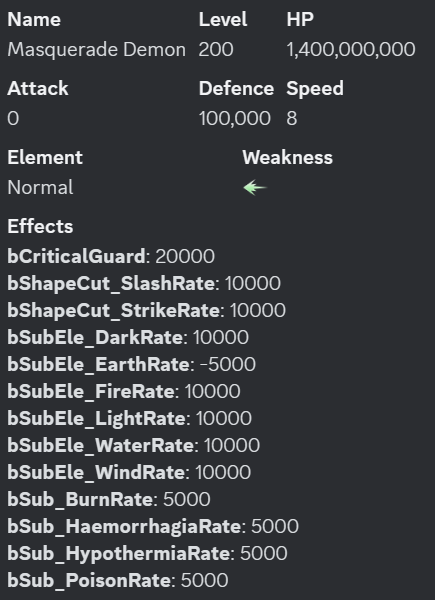
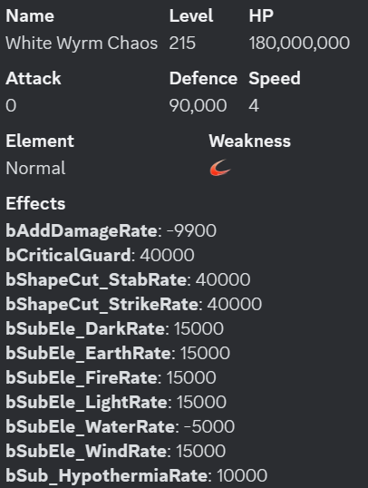

# SAOIF怪物詞條分析

# 前言

    本篇給出一些怪物詞條的分析和乘區歸類
    怪物詞條有很多，這裏先列出常見的一些，後續可能繼續更新
    具體的測試過程就不給出了

# 分析

這裏列出幾個boss包含了常見詞條

某次GoG的惡魔boss

215冥黑白龍

Weakness

    Weakness:對應游戲内的武器弱點，數值為50%

Effects中詞條數值除以10000即真實數值

bAddDamageRate:

    bAddDamageRate:增傷率
    一般出現在怪物詞條為負值表示減傷率
    如bAddDamageRate: -9900表示減傷99%

    乘區：刻印區

bCriticalGuard: 

    bCriticalGuard:爆擊抵抗
    和玩家的爆擊率進行等值抵消
    如bCriticalGuard: 40000表示400%抗爆擊抵抗
    400%爆擊抵抗下，玩家需要500%爆擊率才能保證爆擊

bShapeCut_SlashRate:

bShapeCut_StabRate:

bShapeCut_StrikeRate:

    bShapeCut_SlashRate:斬屬性抗性
    bShapeCut_StabRate:刺屬性抗性
    bShapeCut_StrikeRate:打屬性抗性
    正值表示抗性
    負值表示弱點增傷

    曾經有出現過弱點額外增傷
    如Weakness為打
    且bShapeCut_StrikeRate:-20000
    表示打弱點，額外增傷200%
    則使用打屬性弱點時有250%增傷

    乘區：增傷區

bSubEle_DarkRate:

bSubEle_EarthRate:

bSubEle_FireRate:

bSubEle_LightRate:

bSubEle_WaterRate:

bSubEle_WindRate:

    bSubEle_DarkRate:暗屬性抗性
    bSubEle_EarthRate:土屬性抗性
    bSubEle_FireRate:火屬性抗性
    bSubEle_LightRate:聖屬性抗性
    bSubEle_WaterRate:水屬性抗性
    bSubEle_WindRate:風屬性抗性
    正值表示抗性
    負值表示弱點增傷
    一般為50%
    有部分怪物可能有更高的增傷

    乘區：增傷區

bSub_BurnRate:

bSub_HaemorrhagiaRate:

bSub_HypothermiaRate:

bSub_PoisonRate:

    bSub_BurnRate:灼傷耐性
    bSub_HaemorrhagiaRate:出血耐性
    bSub_HypothermiaRate:凍傷耐性
    bSub_PoisonRate:中毒耐性
    此類耐性多出現在需要叠異常的怪物

    bSub_BurnRate: 5000則表示灼傷耐性100%
    則需玩家要150%概率才能保證造成灼傷

